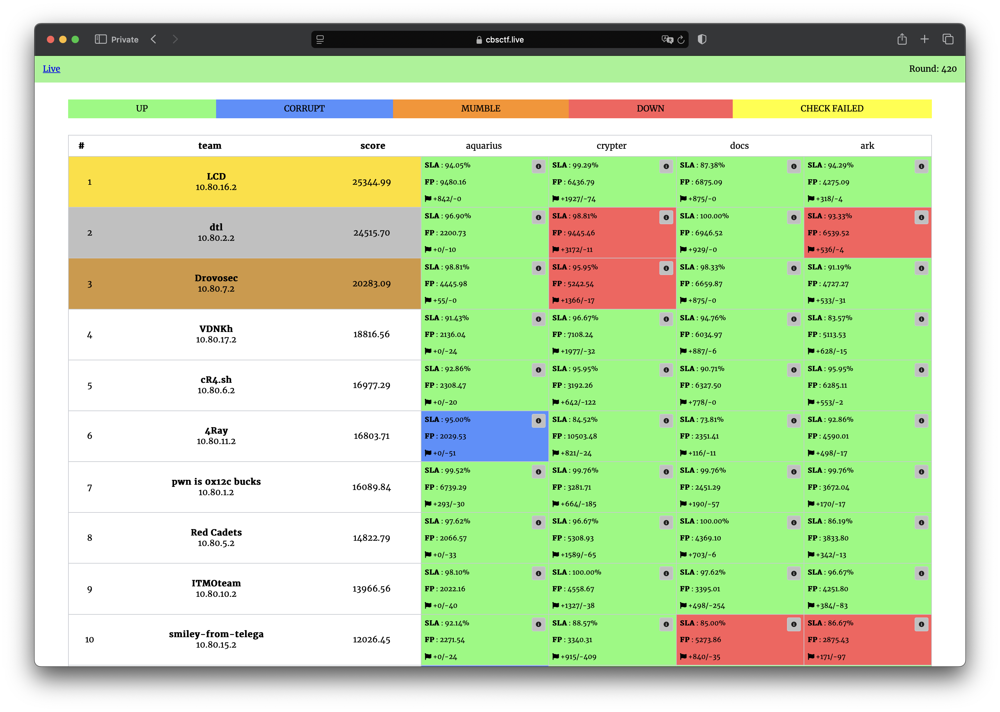

# CTF Cup 2024

The contest was held on December 21, 2024.

Repository contains source code of services, checkers and sploits.

## Results

[Full scoreboard](scoreboard/full.png)

## Services

| Service                            | Language    | Checker                       | Sploits                      | Authors                                                  |
|------------------------------------|-------------|-------------------------------|------------------------------|----------------------------------------------------------|
| **[aquarius](services/aquarius/)** | C++         | [Checker](checkers/aquarius/) | [Sploits](sploits/aquarius/) | [@falamous](https://github.com/falamous)                 |
| **[crypter](services/crypter/)**   | C++         | [Checker](checkers/crypter/)  | [Sploits](sploits/crypter/)  | [@falamous](https://github.com/falamous)                 |
| **[docs](services/docs/)**         | Python & Go | [Checker](checkers/docs/)     | [Sploits](sploits/docs/)     | [@jnovikov](https://github.com/jnovikov)                 |
| **[ark](services/ark/)**           | Rust        | [Checker](checkers/ark/)      | [Sploits](sploits/ark/)      | [@pomo-mondreganto](https://github.com/pomo-mondreganto) |

## Infrastructure

- DevOps: [@pomo_mondreganto](https://github.com/pomo-mondreganto)
- Checksystem: [ForcAD](https://github.com/pomo-mondreganto/ForcAD),
  configuration: [forcad_config.yml](./forcad_config.yml) 
